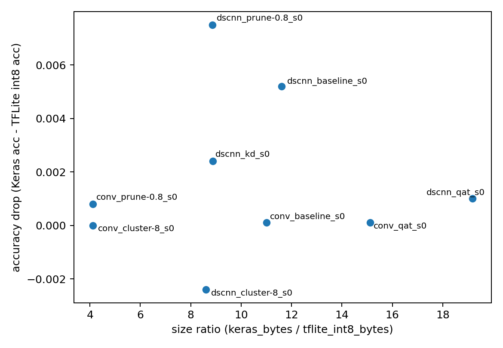

# MNIST Optimization Report

## Summary

Experiments: 9

### Pareto Frontier (latency vs accuracy, int8)

- dscnn_baseline_s0: 0.9429 acc @ 0.008 ms
- dscnn_kd_s0: 0.9531 acc @ 0.008 ms
- conv_qat_s0: 0.9905 acc @ 0.030 ms
- conv_baseline_s0: 0.9909 acc @ 0.035 ms

## Results Table (top 10 by accuracy)

| exp_id             | base   | kind      |   seed |   epochs |   batch |   test_acc |   params |   flops |   sparsity_est |   keras_bytes |   tflite_float_bytes |   tflite_dynamic_bytes |   tflite_int8_bytes |   tflite_float_median_ms |   tflite_dynamic_median_ms |   tflite_int8_median_ms |   tflite_float_acc |   tflite_dynamic_acc |   tflite_int8_acc |   acc_drop_int8 |   size_ratio_int8 |   tflite_float_mean_ms |   tflite_float_p90_ms |   tflite_float_p99_ms |   tflite_float_min_ms |   tflite_float_max_ms |   tflite_float_runs |   tflite_dynamic_mean_ms |   tflite_dynamic_p90_ms |   tflite_dynamic_p99_ms |   tflite_dynamic_min_ms |   tflite_dynamic_max_ms |   tflite_dynamic_runs |   tflite_int8_mean_ms |   tflite_int8_p90_ms |   tflite_int8_p99_ms |   tflite_int8_min_ms |   tflite_int8_max_ms |   tflite_int8_runs |
|:-------------------|:-------|:----------|-------:|---------:|--------:|-----------:|---------:|--------:|---------------:|--------------:|---------------------:|-----------------------:|--------------------:|-------------------------:|---------------------------:|------------------------:|-------------------:|---------------------:|------------------:|----------------:|------------------:|-----------------------:|----------------------:|----------------------:|----------------------:|----------------------:|--------------------:|-------------------------:|------------------------:|------------------------:|------------------------:|------------------------:|----------------------:|----------------------:|---------------------:|---------------------:|---------------------:|---------------------:|-------------------:|
| conv_baseline_s0   | conv   | baseline  |      0 |       10 |     128 |     0.9909 |    34826 |     nan |    0           |        450661 |               142220 |                  39816 |               40960 |                   0.0997 |                     0.0271 |                  0.0352 |             0.9909 |               0.991  |            0.9908 |     9.99801e-05 |          11.0025  |                 0.0997 |                0.0997 |                0.0997 |                0.0997 |                0.0997 |                   1 |                   0.0271 |                  0.0271 |                  0.0271 |                  0.0271 |                  0.0271 |                     1 |                0.0352 |               0.0352 |               0.0352 |               0.0352 |               0.0352 |                  1 |
| conv_qat_s0        | conv   | qat       |      0 |       10 |     128 |     0.9905 |    35036 |     nan |    2.85421e-05 |        620298 |               146320 |                  41456 |               41048 |                   0.5373 |                     0.028  |                  0.0302 |             0.9905 |               0.9905 |            0.9904 |     9.99733e-05 |          15.1115  |                 0.5373 |                0.5373 |                0.5373 |                0.5373 |                0.5373 |                   1 |                   0.028  |                  0.028  |                  0.028  |                  0.028  |                  0.028  |                     1 |                0.0302 |               0.0302 |               0.0302 |               0.0302 |               0.0302 |                  1 |
| conv_prune-0.8_s0  | conv   | prune-0.8 |      0 |       10 |     128 |     0.9875 |    34826 |     nan |    0.797565    |        168375 |               142244 |                  39832 |               40976 |                   0.0575 |                     0.0247 |                  0.0462 |             0.9875 |               0.9874 |            0.9867 |     0.000800012 |           4.10911 |                 0.0575 |                0.0575 |                0.0575 |                0.0575 |                0.0575 |                   1 |                   0.0247 |                  0.0247 |                  0.0247 |                  0.0247 |                  0.0247 |                     1 |                0.0462 |               0.0462 |               0.0462 |               0.0462 |               0.0462 |                  1 |
| conv_cluster-8_s0  | conv   | cluster-8 |      0 |       10 |     128 |     0.9861 |    34826 |     nan |    0           |        168377 |               142260 |                  39840 |               40976 |                   0.0777 |                     0.0266 |                  0.0354 |             0.9861 |               0.9861 |            0.9861 |     1.80244e-08 |           4.10916 |                 0.0777 |                0.0777 |                0.0777 |                0.0777 |                0.0777 |                   1 |                   0.0266 |                  0.0266 |                  0.0266 |                  0.0266 |                  0.0266 |                     1 |                0.0354 |               0.0354 |               0.0354 |               0.0354 |               0.0354 |                  1 |
| dscnn_kd_s0        | dscnn  | kd        |      0 |       10 |     128 |     0.9531 |     1506 |     nan |    0           |         72090 |                 8988 |                   8988 |                8128 |                   0.0078 |                     0.0058 |                  0.0081 |             0.9531 |               0.9531 |            0.9507 |     0.00240003  |           8.86934 |                 0.0078 |                0.0078 |                0.0078 |                0.0078 |                0.0078 |                   1 |                   0.0058 |                  0.0058 |                  0.0058 |                  0.0058 |                  0.0058 |                     1 |                0.0081 |               0.0081 |               0.0081 |               0.0081 |               0.0081 |                  1 |
| dscnn_baseline_s0  | dscnn  | baseline  |      0 |       10 |     128 |     0.9429 |     1506 |     nan |    0           |         94299 |                 8968 |                   8968 |                8120 |                   0.0072 |                     0.007  |                  0.0076 |             0.9429 |               0.9429 |            0.9377 |     0.0052      |          11.6132  |                 0.0072 |                0.0072 |                0.0072 |                0.0072 |                0.0072 |                   1 |                   0.007  |                  0.007  |                  0.007  |                  0.007  |                  0.007  |                     1 |                0.0076 |               0.0076 |               0.0076 |               0.0076 |               0.0076 |                  1 |
| dscnn_qat_s0       | dscnn  | qat       |      0 |       10 |     128 |     0.8962 |     1650 |     nan |    0.000606061 |        165077 |                16120 |                   9032 |                8608 |                   0.0641 |                     0.0077 |                  0.0086 |             0.8962 |               0.8954 |            0.8952 |     0.001       |          19.1772  |                 0.0641 |                0.0641 |                0.0641 |                0.0641 |                0.0641 |                   1 |                   0.0077 |                  0.0077 |                  0.0077 |                  0.0077 |                  0.0077 |                     1 |                0.0086 |               0.0086 |               0.0086 |               0.0086 |               0.0086 |                  1 |
| dscnn_cluster-8_s0 | dscnn  | cluster-8 |      0 |       10 |     128 |     0.7958 |     1506 |     nan |    0.0531208   |         72090 |                 9296 |                   9296 |                8384 |                   0.1584 |                     0.2256 |                  0.0076 |             0.7958 |               0.7958 |            0.7982 |    -0.00240003  |           8.59852 |                 0.1584 |                0.1584 |                0.1584 |                0.1584 |                0.1584 |                   1 |                   0.2256 |                  0.2256 |                  0.2256 |                  0.2256 |                  0.2256 |                     1 |                0.0076 |               0.0076 |               0.0076 |               0.0076 |               0.0076 |                  1 |
| dscnn_prune-0.8_s0 | dscnn  | prune-0.8 |      0 |       10 |     128 |     0.7192 |     1506 |     nan |    0.306773    |         72051 |                 8984 |                   8984 |                8128 |                   0.0068 |                     0.0076 |                  0.0082 |             0.7192 |               0.7192 |            0.7117 |     0.00750002  |           8.86454 |                 0.0068 |                0.0068 |                0.0068 |                0.0068 |                0.0068 |                   1 |                   0.0076 |                  0.0076 |                  0.0076 |                  0.0076 |                  0.0076 |                     1 |                0.0082 |               0.0082 |               0.0082 |               0.0082 |               0.0082 |                  1 |

## Figures

## Keras vs TFLite comparison (top 12 by Keras acc)

| exp_id             | kind      |   test_acc |   tflite_float_acc |   tflite_dynamic_acc |   tflite_int8_acc |   acc_drop_int8 |   keras_bytes |   tflite_float_bytes |   tflite_int8_bytes |   tflite_float_median_ms |   tflite_int8_median_ms |   size_ratio_int8 |
|:-------------------|:----------|-----------:|-------------------:|---------------------:|------------------:|----------------:|--------------:|---------------------:|--------------------:|-------------------------:|------------------------:|------------------:|
| conv_baseline_s0   | baseline  |     0.9909 |             0.9909 |               0.991  |            0.9908 |     9.99801e-05 |        450661 |               142220 |               40960 |                   0.0997 |                  0.0352 |          11.0025  |
| conv_qat_s0        | qat       |     0.9905 |             0.9905 |               0.9905 |            0.9904 |     9.99733e-05 |        620298 |               146320 |               41048 |                   0.5373 |                  0.0302 |          15.1115  |
| conv_prune-0.8_s0  | prune-0.8 |     0.9875 |             0.9875 |               0.9874 |            0.9867 |     0.000800012 |        168375 |               142244 |               40976 |                   0.0575 |                  0.0462 |           4.10911 |
| conv_cluster-8_s0  | cluster-8 |     0.9861 |             0.9861 |               0.9861 |            0.9861 |     1.80244e-08 |        168377 |               142260 |               40976 |                   0.0777 |                  0.0354 |           4.10916 |
| dscnn_kd_s0        | kd        |     0.9531 |             0.9531 |               0.9531 |            0.9507 |     0.00240003  |         72090 |                 8988 |                8128 |                   0.0078 |                  0.0081 |           8.86934 |
| dscnn_baseline_s0  | baseline  |     0.9429 |             0.9429 |               0.9429 |            0.9377 |     0.0052      |         94299 |                 8968 |                8120 |                   0.0072 |                  0.0076 |          11.6132  |
| dscnn_qat_s0       | qat       |     0.8962 |             0.8962 |               0.8954 |            0.8952 |     0.001       |        165077 |                16120 |                8608 |                   0.0641 |                  0.0086 |          19.1772  |
| dscnn_cluster-8_s0 | cluster-8 |     0.7958 |             0.7958 |               0.7958 |            0.7982 |    -0.00240003  |         72090 |                 9296 |                8384 |                   0.1584 |                  0.0076 |           8.59852 |
| dscnn_prune-0.8_s0 | prune-0.8 |     0.7192 |             0.7192 |               0.7192 |            0.7117 |     0.00750002  |         72051 |                 8984 |                8128 |                   0.0068 |                  0.0082 |           8.86454 |

### Latency: float vs int8 (median)

### Accuracy drop vs size ratio (int8)

## Training accuracy curves

